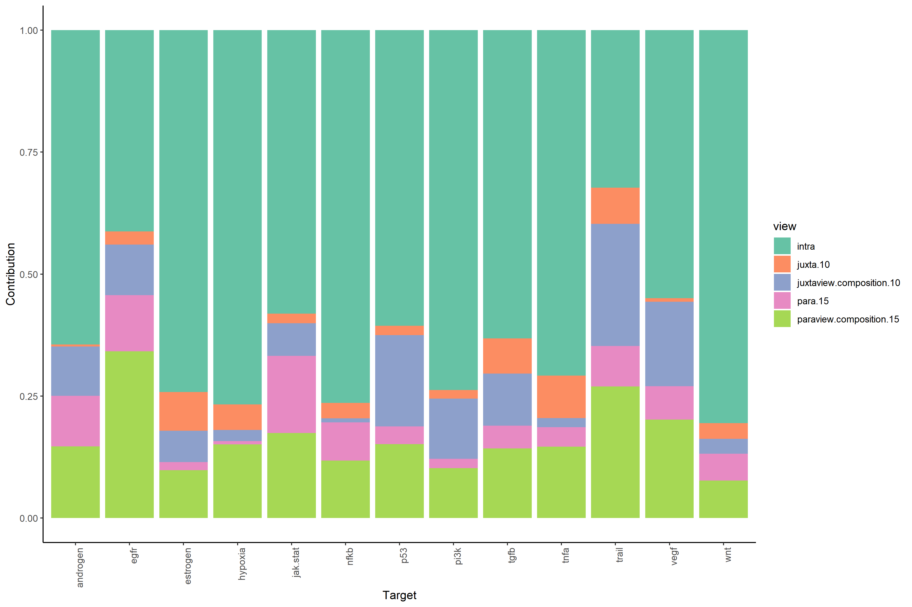
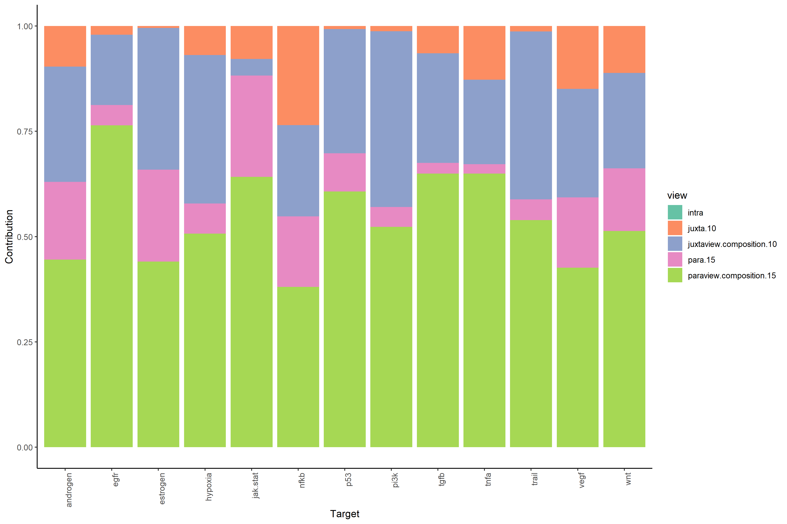
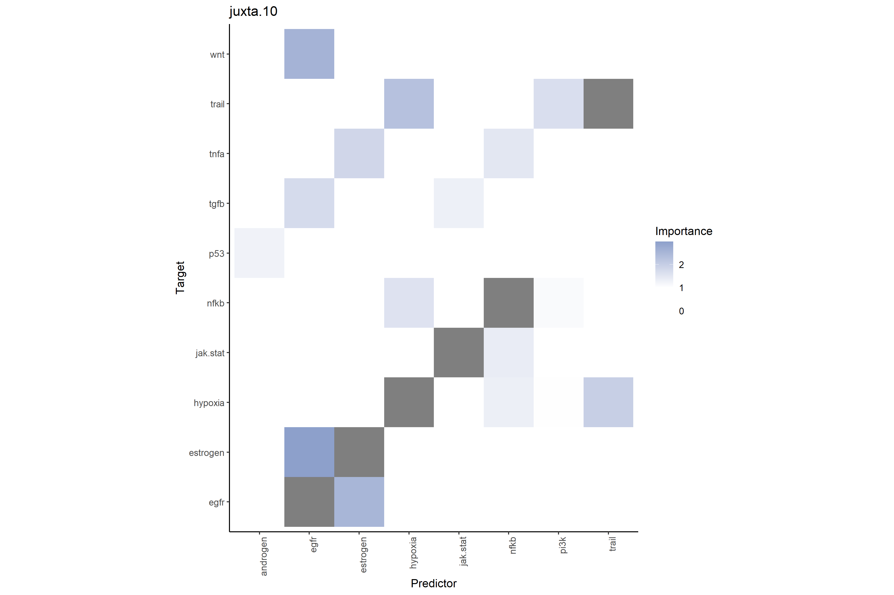
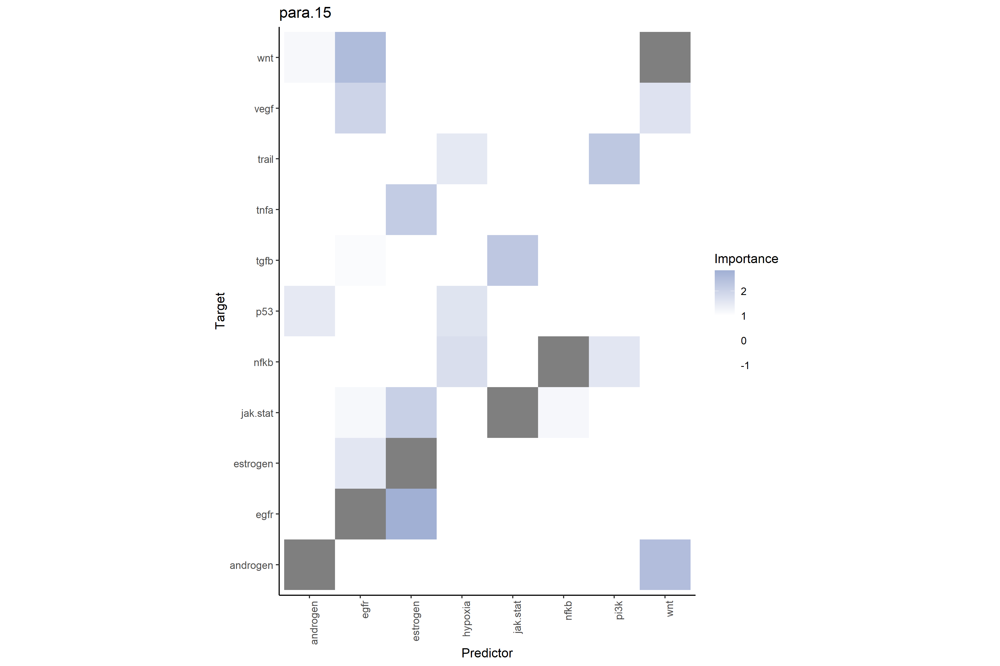
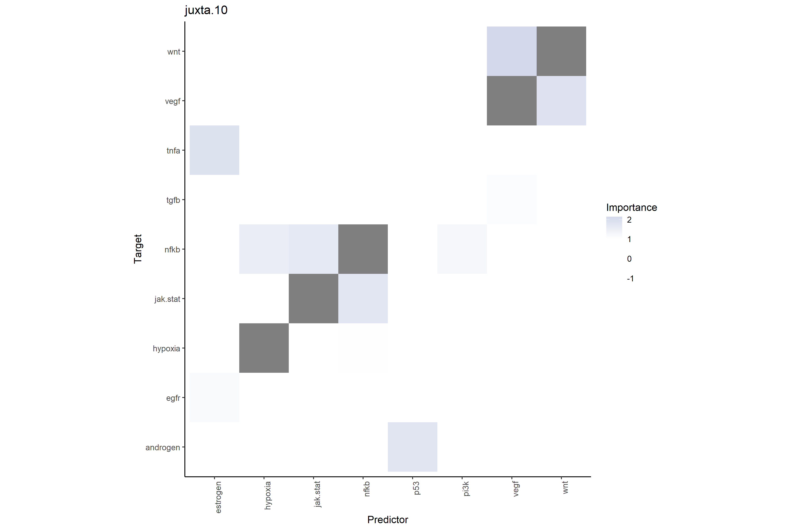
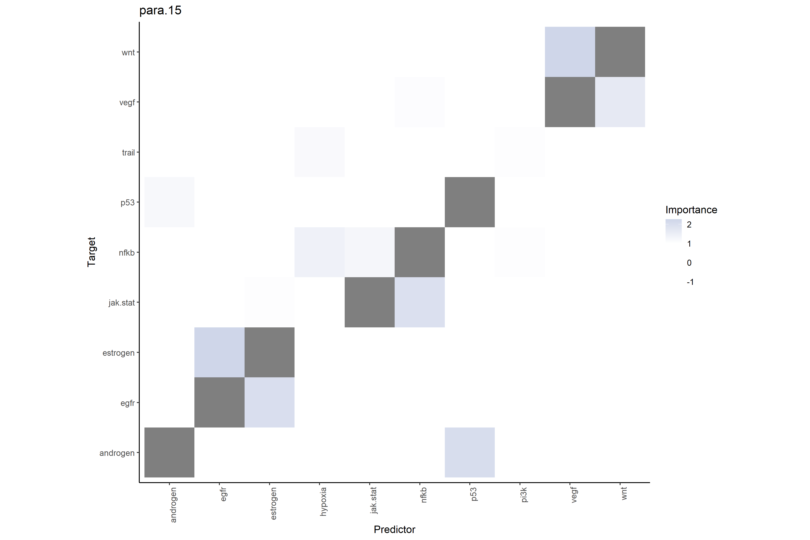
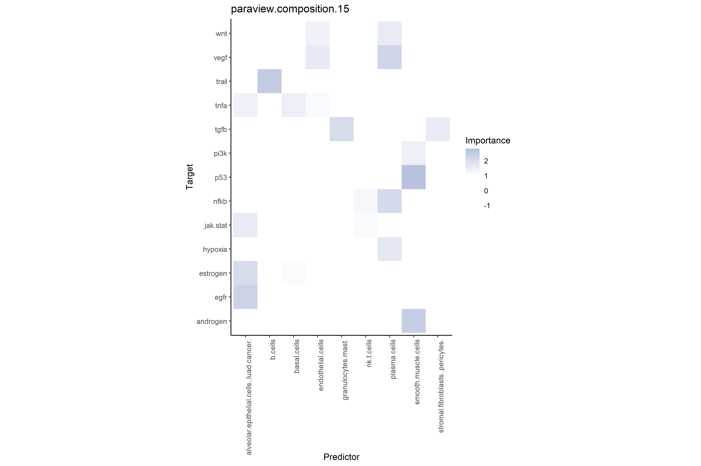
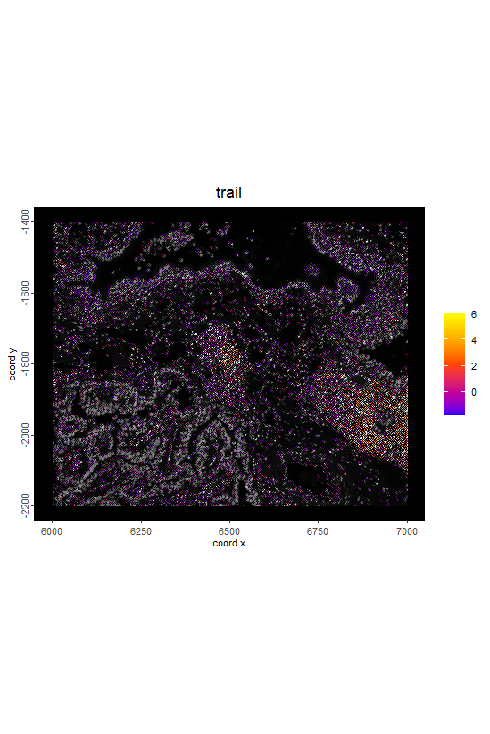
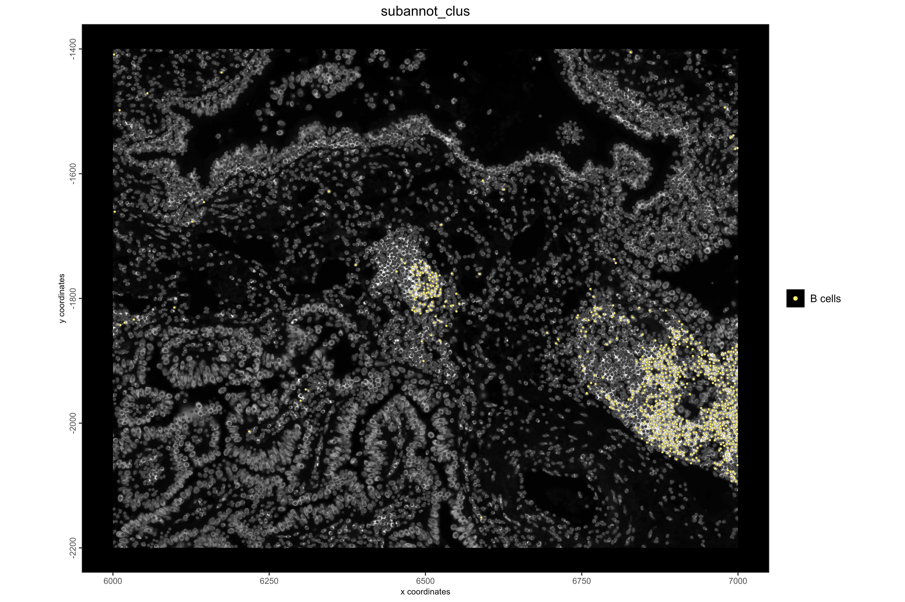

<!--
---
title: "Xenium Human Lung Cancer Analysis with MISTy"
output: 
  html_document:
    number_sections: true
    toc: true
pkgdown:
  as_is: true
vignette: >
  %\VignetteIndexEntry{Xenium Human Lung Cancer Analysis with MISTy}
  %\VignetteEngine{knitr::rmarkdown}
  %\VignetteEncoding{UTF-8}
---
-->
# 1. Summary
This tutorial analyzes a Xenium-derived human lung cancer dataset using Giotto and MISTy to identify cell types, estimating pathway activities, and modeling spatial cell–cell interactions to gain insights into the tumor microenvironment. 

# 2. Environment Setup and Library Initialization
**Setting up the working environment and loading necessary libraries.**

```{r, eval=FALSE}
# Configure Python environment for Giotto
library(reticulate)
use_python("C:/Users/your_username/anaconda3/envs/giotto_env/python.exe", required = TRUE)

# Load core libraries
library(Giotto)
library(mistyR)

# Parallel processing
library(future)
plan(multisession)

# Data manipulation libraries
library(data.table)
library(janitor)
library(Matrix)
library(dplyr)
library(tidyverse)

# Pathway analysis libraries
library(msigdbr)
library(decoupleR)
library(SummarizedExperiment)
```
# 3. Data Setup
## 3.1 Configure Paths and Download Data
Setting up data paths and downloading the Xenium lung cancer dataset.
```{r, eval=FALSE}
# Set up paths
data_path <- "/Users/your_username/data/xenium_lung"
save_dir <- '/Users/your_username/results/xenium_lung'
dir.create(save_dir, recursive = TRUE)

# Download the mini dataset
options("timeout" = Inf)
download.file(
  url = "https://zenodo.org/records/13207308/files/workshop_xenium.zip?download=1",
  destfile = file.path(save_dir, "workshop_xenium.zip"),
  mode = "wb",           # Force binary mode
  method = "libcurl",    # Use libcurl method
  timeout = 300          # Set longer timeout
)

# Extract the downloaded data
unzip(file.path(save_dir, "workshop_xenium.zip"), 
      exdir = data_path)
```
**Note:** This is a subset of the full dataset. 

```{r, eval=FALSE}
- Full: -16.039, 12342.984, -3511.515, -294.455 (xmin, xmax, ymin, ymax)
- Mini: 6000,    7000,      -2200,     -1400    (xmin, xmax, ymin, ymax)
```


*Image from Section 10 of the [2024 Giotto Workshop](https://drieslab.github.io/giotto_workshop_2024/xenium-1.html#aggregate-analyses-workflow).*


# 4. Giotto Object Creation 
## 4.1 Creating and Setting Up the Giotto Object
> **Note:** The following code demonstrates the setup of a Giotto object, including loading expression data, cell metadata, and morphology images. These preprocessing steps are adapted from [the Giotto 2024 Workshop tutorial (sections 10.1 to 10.7)](https://drieslab.github.io/giotto_workshop_2024/xenium-1.html#aggregate-analyses-workflow) and are included here for completeness.

<details>
<summary>Click to expand for details </summary>

- **Creating the Giotto object:** Initialized using `createGiottoXeniumObject()` from the raw Xenium directory.
  ```{r, eval= FALSE}
  g <- createGiottoXeniumObject(xenium_dir = data_path)
  ```
- **Setting analysis instructions:** Configured save directory and plot-saving behavior via the `instructions()` function.
  ```{r, eval=FALSE}
  instructions(g, "save_dir") <- save_dir
  instructions(g, "save_plot") <- TRUE
  ```
- **Adding spatial information:** Added centroid positions for `"cell"` and `"nucleus"` polygon types with `addSpatialCentroidLocations()`.
  ```{r, eval = FALSE}
  
  g <- addSpatialCentroidLocations(g, poly_info = "cell")
  g <- addSpatialCentroidLocations(g, poly_info = "nucleus")
  ```
- **Load Expression Data and Cell Metadata:** Imported Xenium data, loaded gene expression matrices and cell metadata, then integrated them into Giotto object to enable downstreatm anlysis.
  ```{r, eval = FALSE}
    
  x <- importXenium(data_path) 
  
  force(x)
  
  x$qv <- 20 # default
  tx <- x$load_transcripts()
  
  plot(tx[[1]])
  
  # remove to save space
  rm(tx) 

  # change to mtx instead of .h5 which is not in the mini dataset
  x$filetype$expression <- "mtx" 
  
  ex <- x$load_expression()
  featType(ex)
  
  force(g)
  
  featType(ex[[2]]) <- c("NegControlProbe")
  featType(ex[[3]]) <- c("NegControlCodeword")
  featType(ex[[4]]) <- c("UnassignedCodeword")
  
  g2 <- g
  # append the expression info
  g2 <- setGiotto(g2, ex)
  
  # load cell metadata
  cx <- x$load_cellmeta()
  g2 <- setGiotto(g2, cx)
  
  force(g2)
  #remove to save space 
  rm(g2) 

  ```
- **Metadata and image integration:** Expression matrices and cell metadata were loaded into the Giotto object using `setGiotto()`. Multiple morphology image channels were imported via `createGiottoLargeImageList()`, with brightness adjusted for selected channels, and then attached to the Giotto object for combined spatial and morphological analysis.
  
  ```{r, eval = FALSE}
  
  # Check if morphology images exist in your Xenium directory
  xenium_dir <- "data/xenium_lung"  # Directory, not file
  image_files <- list.files(xenium_dir, pattern = "morphology", full.names = TRUE)
  
  
  
  img_paths <- c(
    sprintf("data/xenium_lung/morphology_focus/morphology_focus_%04d.tif", 0:3),
    "data/xenium_lung/he_mini.tif"
  )
  
  img_list <- createGiottoLargeImageList(
    img_paths, 
    # naming is based on the channel metadata above
    names = c("DAPI", "18S", "ATP1A1/CD45/E-Cadherin", "alphaSMA/Vimentin", "HE"),
    use_rast_ext = TRUE,
    verbose = FALSE
  )
  
  # make some images brighter
  img_list[[1]]@max_window <- 5000
  img_list[[2]]@max_window <- 5000
  img_list[[3]]@max_window <- 5000
  
  # append images to gobject
  g <- setGiotto(g, img_list)

  ```

- **Quality control and normalization:** Computed overlaps, filtered low-quality data, normalized the expression matrix, and added per-cell statistics.
  ```{r, eval = FALSE}
    
  g <- calculateOverlap(g,
                        spatial_info = "cell",
                        feat_info = "rna"
  )
  
  g <- overlapToMatrix(g)
  g <- addStatistics(g, expression_values = "raw")
  
  cell_stats <- pDataDT(g)
  ggplot2::ggplot(cell_stats, ggplot2::aes(total_expr)) +
    ggplot2::geom_histogram(binwidth = 5)
  
  
  # very permissive filtering, mainly for removing 0 values
  g <- filterGiotto(g,
                    expression_threshold = 1,
                    feat_det_in_min_cells = 1,
                    min_det_feats_per_cell = 5
  )
  
  
  g <- normalizeGiotto(g)
  # overwrite original results with those for normalized values
  g <- addStatistics(g)

  ```
  
- **Dimensionality reduction and clustering:** Ran PCA, UMAP, and Leiden clustering.
  ```{r, eval = FALSE}
  
  g <- runPCA(g, feats_to_use = NULL)
  
  
  screePlot(g, ncp = 30)
  
  
  g <- runUMAP(g, 
               dimensions_to_use = seq(15), 
               n_neighbors = 40 # default
  )
  
  Giotto::plotPCA(g)
  plotUMAP(g)
  
  
  g <- createNearestNetwork(g,
                            dimensions_to_use = seq(15), 
                            k = 40
  )
  
  
  g <- doLeidenCluster(g)


  ```

</details>


# 5. Marker Gene Analysis
## 5.1 Finding Cluster Specific Marker Genes 
Following Giotto object creation, preprocessing, and clustering, the analysis moves to identifying cluster-specific marker genes. The Scran method is applied to detect genes enriched in each Leiden cluster, allowing likely cell types to be inferred. 

```{r, eval=FALSE}

res_scran <- findMarkers_one_vs_all(g, 
                                    cluster_column = "leiden_clus", 
                                    method = "scran",
                                    expression_values = "normalized"
)

# top 2 genes per cluster
topgenes_scran <- res_scran[, head(.SD, 2), by = 'cluster']
```

## 5.2 Visualizing Top Ranked Marker Genes
The top two ranked marker genes per cluster are then visualized using violin plots, showing the normalized expression of these markers across all clusters.
```{r, eval = FALSE}
violinPlot(g, 
           feats = unique(rankgenes_scran$feats), #unique
           cluster_column = "leiden_clus", 
           save_param = list(base_height = 20,base_width = 10)
)
``` 


# 6. Cell Type Annotation
## 6.1 Manual Cell Type Assignment

Manual cell type assignment was guided by the identification of cluster-specific marker genes using the scran method. To ensure that these predicted assignments accurately reflected the underlying biology, expression patterns were validated using dot plots and UMAP-based visualizations.

In the dot plot, the Y-axis represents marker genes corresponding to major cell types, while the X-axis shows cluster numbers (1–12) identified from the analysis. Dot size indicates the percentage of cells within a cluster expressing a given gene (with reference values of 25%, 50%, and 75%), and dot color reflects the average expression level of the gene in that cluster, scaled from 0.0 to 8.0 (normalized expression values).


```{r, eval=FALSE}

GiottoVisuals::dotPlot(
  g,
  spat_unit = "cell",
  feats = c(   "FOXJ1", "DNAAF1", "SCGB2A1", #Bronchial Epithelial (Ciliated/ Club)
               "VWF", "PECAM1",              #Endothelial
               "PDGFRA", "COL5A2",           #Fibroblast  
               "PDGFRB",                     #Pericyte
               "MYH11", "ACTA2",             #Smooth Muscle
               "SOX2",                       #Basal cells
               "SFTA2", "ACE2",              #Alveolar Epithelial Type 2 
               "AGER", "PDPN",               #Alveolar Epithelial Type 1
               "ERBB2", "EGFR", "EPCAM", "KRT7", #LUAD Cancer
               "MET",  "MYC",                #Oncogenes
               "NKG7", "CD3E",               #NKcell/ Tcells
               "MS4A1", "CD19", "CD79A", "MZB1", #Bcell/ Plasma 
               "CD68", "MRC1", "CD14",       #Macrophage (Tissue-Resident: Alveolar, Interstitial) / Monocytes
               "CD83", "CD86",               #Dendritic 
               "KIT", "MS4A2"                #Granulocytes (Mast/ etc...)
               ), 
  cluster_column = "leiden_clus",
  dot_size = function(x) mean(x != 0) * 100,
  dot_size_threshold = 0,
  dot_scale = 6,
  dot_color = mean,
  dot_color_gradient = c("royalblue3", 'orangered', "yellow"),
  gradient_style = "s",
  expression_values = "normalized",
  show_legend = TRUE,
  legend_text = 10,
  legend_symbol_size = 2,
  background_color = "white",
  axis_text = 10, 
  default_save_name = "dotPlot",
  save_param = list(base_height = 8,base_width = 5)
)
```


To complement the cluster-level overview from the dot plot, a smaller panel of representative marker genes (e.g., CD3E for T cells, SFTA2 for alveolar AT2 cells, PDGFRA for fibroblasts, CD68 for myeloid cells) was visualized using dimFeatPlot2D() on the UMAP. In these plots, the X and Y axes correspond to coordinates from the dimensional reduction (UMAP), each dot represents a single cell positioned based on transcriptional similarity, and the color scale (blue to green) indicates the expression level of the gene (0.0 to 10.0 normalized counts), with blue representing low or no expression and green representing high expression. Together, the dot plot and dimFeatPlot2D plots provide complementary perspectives that enabled manual annotation of clusters with their putative biological cell types.

```{r, eval=FALSE}
# Representative single marker genes for broad cell types
single_marker_genes <- c(
  "CD3E",     # NK / T cells
  "SFTA2",    # Alveolar epithelial (AT2-like / LUAD cancer)
  "PDGFRA",   # Fibroblasts / Stromal
  "CD68",     # Myeloid (Macrophages/Monocytes/DCs)
  "MS4A1",    # B cells
  "FOXJ1",    # Ciliated epithelial
  "PECAM1",   # Endothelial cells
  "SOX2",     # Basal cells
  "ACTA2",    # Smooth muscle
  "MZB1",     # Plasma cells
  "KIT"       # Mast cells
)


dimFeatPlot2D(g, 
              expression_values = "normalized", 
              feats = single_marker_genes, 
              dim_reduction_to_use = "umap", 
              cow_n_col = 2, 
              point_size = 0.2, 
              cell_color_gradient = c("blue", "green"), 
              save_param = list(base_height = 10, base_width = 6))

```


```{r, eval=FALSE}
# Define cell types based on marker gene analysis
cell_types <- c(
  "NK / T cells",      
  "Alveolar Epithelial cells (LUAD CANCER)",  #Type 1, Type 2
  "Stromal (Fibroblasts/ Pericytes)",      
  "Myeloid (Macrophages / Monocytes) and Dendritic cells",      
  "B cells",           
  "Bronchial Epithelial (Ciliated) cells", #possibility of tumor 
  "Endothelial cells", 
  "Basal cells",      
  "Alveolar Epithelial cells (LUAD CANCER)",
  "Smooth muscle cells", 
  "Plasma cells",     
  "Granulocytes (Mast)"         
)

# Assign names to cell types vector
names(cell_types) <- 1:length(cell_types)

# Annotate Giotto object with cell types
g <- annotateGiotto(gobject = g, 
                    spat_unit = "cell", 
                    annotation_vector = cell_types,
                    cluster_column = 'leiden_clus', 
                    name = 'subannot_clus')

# Store annotated object
xenium_lungcancer_test <- g
```
# 7. Pathway Activity Analysis
## 7.1 Prepare Data
```{r, eval=FALSE}

norm_matrix <- Giotto::getExpression(xenium_lungcancer_test, values = "normalized", output = "matrix")

geometry <- getSpatialLocations(
  gobject = xenium_lungcancer_test, 
  spat_unit = "cell",  #default
  output = "data.table"
)
geometry <- geometry[, c("sdimx", "sdimy")]
setnames(geometry, c("sdimx", "sdimy"), c("row", "col"))

```
## 7.2 Run PROGENy Pathway Analysis
We use PROGENy to estimate pathway activity scores for each cell in the human lung cancer sample, capturing functional signaling rather than just gene expression. These activity scores are provided to MISTy later, which models how cells influence each other and contribute to the tumor microenvironment. By combining pathway activity with spatial coordinates, MISTy can estimate cell-cell interactions and functional contributions based on physical proximity and tissue context. 
```{r, eval=FALSE}
# Get PROGENy model for human
model <- get_progeny(organism = "human", top = 500)

# Estimate pathway activity using multivariate linear model
est_path_act <- run_mlm(norm_matrix, model, .mor = NULL) 

# Convert to wide format for downstream analysis
est_path_act_wide <- est_path_act %>% 
  pivot_wider(id_cols = condition, names_from = source, values_from = score) %>%
  column_to_rownames("condition") 

# Clean column names
colnames(est_path_act_wide) <- est_path_act_wide %>% 
  clean_names(parsing_option = 0) %>% 
  colnames(.)


# Add progeny results to object
path_act_exprobj = createExprObj(t(est_path_act_wide), name = "progeny")
xenium_lungcancer_test <- setExpression(xenium_lungcancer_test, path_act_exprobj, name = "progeny") #cell and rna are default

```

## 7.3 Prepare Cell Type Composition Matrix

```{r, eval=FALSE}
# Extract cell type metadata
metadata <- getCellMetadata(g, spat_unit = "cell")
cell_types <- metadata$subannot_clus

# Create one-hot encoded matrix for cell types
cell_type_factor <- factor(cell_types)
cell_type_onehot <- model.matrix(~ cell_type_factor - 1)
colnames(cell_type_onehot) <- gsub("cell_type_factor", "", colnames(cell_type_onehot))

# Set proper row names using cell IDs
actual_cell_ids <- colnames(xenium_lungcancer_test@expression$cell$rna$raw)
rownames(cell_type_onehot) <- actual_cell_ids

# Clean column names
colnames(cell_type_onehot) <- cell_type_onehot %>% 
  as_tibble() %>%
  clean_names(parsing_option = 0) %>% 
  colnames(.)

# Convert to tibble for MISTy
composition_xenium <- as_tibble(cell_type_onehot)
```
# 8. MISTy Analysis

MISTy (Multiview Intercellular SpaTial modeling framework) is a computational framework designed to explore how different biological factors interact within spatially resolved transcriptomics data. This analysis applies MISTy to human lung Xenium data to examine how variations in cell-type composition and pathway activity shape spatial gene expression patterns.

#### Citation  

> <sub><b>Tanevski, J., Flores, R.O.R., Gabor, A. et al.</b> (2022).  
> <i>Explainable multiview framework for dissecting spatial relationships from highly multiplexed data</i>.  
> <i>Genome Biology, 23</i>, 97.  
> <a href="https://doi.org/10.1186/s13059-022-02663-5">https://doi.org/10.1186/s13059-022-02663-5</a></sub>  

---

#### MISTy Tutorial Reference  

> <sub>Workflow adapted from:  
> <a href="https://saezlab.github.io/mistyR/articles/FunctionalAndStructuralPipeline.html">Functional and Structural Pipeline — mistyR documentation</a></sub>  


## 8.1 Create MISTy Views

Spatial views for MISTy are set with the juxtaview at 20 μm (approximately the average cell diameter) to capture immediate neighbors and the paraview at 50 μm to capture a broader regional context. These views are then combined to assess spatial variance in pathway activity across the sample: intra.R2 represents the spatial variance of pathway activity across all cells in the tissue that can be explained by each cell's own intrinsic features, while gain.R2 represents the additional percentage of variance explained when spatial context is added to the model, including both immediate neighbors (juxtaview) and broader spatial environment (paraview).

The `final_misty_views` object integrates **five complementary spatial views**, enabling the simultaneous assessment of both intrinsic and contextual determinants of pathway activity. These views are defined as follows:  

### Spatial Views  

1. **intra** – Measures how well each cell's intrinsic features (predictors) predict that same cell's target features (self-prediction).
2. **juxta.path.20** – Measures how well pathway activity within 20μm neighborhoods (predictors) predicts target features at focal points.
3. **para.path.50** – Measures how well pathway activity within 50μm neighborhoods (predictors) predicts target features at focal points.
4. **juxta.composition.20** –  Measures how well cell composition within 20μm neighborhoods (predictors) predicts target features at focal points.
5. **para.composition.50** – Measures how well cell composition within 50μm neighborhoods (predictors) predicts target features at focal points.

Together, these views provide a comprehensive framework for quantifying how both **cell-intrinsic states** and **spatially organized neighborhoods** influence cellular signaling and functional heterogeneity in the tissue microenvironment.  

```{r, eval=FALSE}

path_act_views <- create_initial_view(est_path_act_wide) %>%
  add_juxtaview(geometry, neighbor.thr = 20) %>% 
  add_paraview(geometry, l = 50, family = "gaussian")


# Create cell composition spatial views
comp_views <- create_initial_view(composition_xenium) %>%
  add_juxtaview(geometry, neighbor.thr = 20) %>%
  add_paraview(geometry, l = 50, family = "gaussian")


# Combine pathway and composition views into comprehensive view object
# Creates 5 predictor views:
# (1) intra: Cell's own composition (intrinsic cell type identity)
# (2) juxta.path.20: Average pathway activity of immediate neighbors (≤20μm)
# (3) para.path.50: Smoothed pathway activity of broader environment (≤50μm)
# (4) juxta.composition.20: Cell type composition of immediate neighbors (≤20μm)
# (5) para.composition.50: Cell type composition of broader environment (≤50μm)


final_misty_views <- comp_views %>%
  add_views(create_view("juxtaview.path.20", 
                        path_act_views[["juxtaview.20"]]$data, 
                        "juxta.path.20")) %>% 
  add_views(create_view("paraview.path.50", 
                        path_act_views[["paraview.50"]]$data, 
                        "para.path.50")) %>%
  add_views(create_view("juxtaview.composition.20",
                        comp_views[["juxtaview.20"]]$data,
                        "juxta.composition.20")) %>%
  add_views(create_view("paraview.composition.50",
                        comp_views[["paraview.50"]]$data,
                        "para.composition.50"))

```
## 8.2 Run MISTy Analysis
```{r, eval=FALSE}

# Standard MISTy analysis (with intrinsic view)
run_misty(
  views = final_misty_views,  # Updated to use complete views
  cv.folds = 10,  
  #target.subset = pathway_names, # Warning appears because we're predicting pathway activities 
  # from cell type compositions - this is expected cross-modal prediction in Xenium spatial data
  results.folder = file.path(save_dir, "misty_results_complete") # Updated folder name
)

# Spatial-only analysis (bypass intrinsic view)
# Tests purely spatial predictive power without cell's own composition
run_misty(final_misty_views, file.path(save_dir, "misty_results_lm_complete"), 
          model.function = linear_model, bypass.intra = TRUE)

```

## 8.3 Collect MISTy Results


```{r, eval = FALSE}

misty_results_complete <- collect_results(file.path(save_dir, "misty_results_complete"))
misty_results_complete_linear <- collect_results(file.path(save_dir, "misty_results_lm_complete"))
misty_results_com_path_act <- collect_results("result/xenium_lung/comp_path_act/")


misty_results_complete %>%
  plot_improvement_stats("intra.R2") %>%
  plot_improvement_stats("gain.R2")


```


```{r, eval = FALSE}
# Spatial-only analysis performance
# In bypass.intra mode, gain.R2 shows purely spatial predictive power
misty_results_complete_linear %>%
  plot_improvement_stats("gain.R2")
```


```{r, eval = FALSE}
# Pathway-only results
misty_results_com_path_act %>%
  plot_improvement_stats("intra.R2") %>%
  plot_improvement_stats("gain.R2") 

```


## 8.4 Interpretations

- **High intra.R²** → Pathway activity is determined by a cell’s intrinsic identity.  
- **High gain.R²** → Incorporating spatial neighborhood information provides additional predictive power beyond intrinsic identity.  

```{r, eval= FALSE}

misty_results_complete %>% 
  plot_view_contributions() 
```


```{r, eval = FALSE}
# Spatial-only analysis - view contributions without intrinsic information
misty_results_complete_linear %>%
  plot_view_contributions()

```




## 8.5 Interaction Heatmaps

Heatmap showing how well cell type composition within 20μm neighborhoods (predictors, X-axis) predicts cell type abundance at focal points (targets, Y-axis). Color intensity represents importance values: darker colors indicate stronger positive predictive relationships, lighter colors indicate negative relationships, and white indicates no predictive relationship. Each cell represents the predictive strength of a neighborhood cell type for a focal cell type.
Interpretation Example: The dark colored square at the intersection between stromal cells (predictor) and NKT cells (target) indicates that focal points with many stromal cells within their 20μm neighborhood are highly predictive of having high NKT cell abundance at that central location. 

```{r, eval = FALSE}


# Pathway-pathway interactions at close range (≤20μm)
# Shows how neighbor cells' pathway activities influence target cell pathways
misty_results_complete %>%
  plot_interaction_heatmap("juxta.path.20", clean = TRUE)

```



```{r, eval = FALSE}

# Cell type-pathway interactions at close range (≤20μm) 
# Shows how neighbor cell types influence target cell pathway activities
misty_results_complete %>%
  plot_interaction_heatmap("juxta.composition.20", clean = TRUE)

```


```{r, eval = FALSE}

# Pathway-pathway interactions at broader range (≤50μm)
# Shows how regional pathway environment influences target cell pathways
misty_results_complete %>%
  plot_interaction_heatmap("para.path.50", clean = TRUE)
```


```{r, eval = FALSE}

# Cell type-pathway interactions at broader range (≤50μm)
# Shows how regional cellular composition influences target cell pathway activities
misty_results_complete %>%
  plot_interaction_heatmap("para.composition.50", clean = TRUE)
```


## Spatial Only Anlysis Heatmaps

```{r, eval = FALSE}

misty_results_complete_linear %>%
  plot_interaction_heatmap("juxta.path.20", clean = TRUE) 
```


```{r, eval = FALSE}
misty_results_complete_linear %>%
  plot_interaction_heatmap("juxta.composition.20", clean = TRUE)

```


Following heatmap shows how the broader spatial neighborhood composition predicts local cell type abundance.
```{r, eval= FALSE}
misty_results_complete_linear %>%
  plot_interaction_heatmap("para.path.50", clean = TRUE) 
```


```{r, eval= FALSE}
misty_results_complete_linear %>%
  plot_interaction_heatmap("para.composition.50", clean = TRUE)

```



## 8.7 Spatial Validation
Example 1: Visualize B cells and TRAIL pathway activity. TRAIL is involved in immune-mediated apoptosis, expect high activity near immune cells.


```{r, eval = FALSE}
# Visualize TRAIL pathway activity
spatFeatPlot2D(xenium_lungcancer_test,
               spat_unit = "cell", 
               expression_values = "progeny", 
               show_image = TRUE, 
               feats = "trail", 
               gradient_style = "sequential", 
               cell_color_gradient = c("blue", "orangered", "yellow"), 
               background_color = "black", 
               point_size = 1, 
               save_plot = TRUE,   # Enable automatic saving
               save_param = list(
                 base_height = 8, 
                 base_width = 12, 
                 dpi = 600,
                 units = "in",
                 save_format = "png",
                 save_name = "14_TRAILPathway",
                 save_dir = save_dir  # Save to current working directory
               ))

```



```{r, eval = FALSE}
# Visualize B cell locations
spatPlot2D(xenium_lungcancer_test,
           spat_unit = "cell", 
           cell_color = "subannot_clus", 
           show_image = TRUE, 
           select_cell_groups = "B cells", 
           point_size = 1, 
           other_point_size = 0.7, 
           other_cell_color = "#434343", 
           background_color = "black", 
           save_plot = TRUE,   # Enable automatic saving
           save_param = list(
             base_height = 8, 
             base_width = 12, 
             dpi = 600,
             units = "in",
             save_format = "png",
             save_name = "15_BCellLocations",
             save_dir = save_dir  # Save to current working directory
           ))

```



Example 2: Visualize LUAD cancer cells and EGFR pathway activity. EGFR is frequently dysregulated in lung adenocarcinoma - expect high activity in cancer regions

```{r, eval = FALSE}
#Visualize EGFR pathway activity
spatFeatPlot2D(xenium_lungcancer_test,
               spat_unit = "cell", 
               expression_values = "progeny", 
               show_image = TRUE, 
               feats = "egfr",  
               gradient_style = "sequential", 
               cell_color_gradient = c("blue", "orangered", "green"), 
               background_color = "black", 
               point_size = 1, 
               save_plot = TRUE,   # Enable automatic saving
               save_param = list(
                 base_height = 8, 
                 base_width = 12, 
                 dpi = 600,
                 units = "in",
                 save_format = "png",
                 save_name = "16_EGFRPathway",
                 save_dir = save_dir  # Save to current working directory
               ))

```


```{r, eval = FALSE}
# Visualize LUAD cancer cell locations
spatPlot2D(xenium_lungcancer_test,
           spat_unit = "cell", 
           cell_color = "subannot_clus", 
           show_image = TRUE, 
           select_cell_groups = "Alveolar Epithelial cells (LUAD CANCER)", 
           point_size = 1.1, 
           other_point_size = 0.7, 
           other_cell_color = "#434343", 
           background_color = "black", 
           save_plot = TRUE,   # Enable automatic saving
           save_param = list(
             base_height = 8, 
             base_width = 12, 
             dpi = 600,
             units = "in",
             save_format = "png",
             save_name = "17_LUADCancerLocations",
             save_dir = save_dir  # Save to current working directory
           ))
```


Example 3 : NK/T cells and NFKB PATHWAY. NFκB is key in immune activation - expect high activity in immune cell regions. In lung cancer, NK/T cells often cluster near tumor boundaries

```{r, eval = FALSE}
# Visualize NFκB pathway activity

spatFeatPlot2D(xenium_lungcancer_test,
               spat_unit = "cell", 
               show_image = TRUE, 
               expression_values = "progeny", 
               feats = "nfkb",  
               gradient_style = "sequential", 
               cell_color_gradient = c("blue","red", "yellow","green"), 
               background_color = "black", 
               point_size = 1, 
               save_plot = TRUE,   # Enable automatic saving
               save_param = list(
                 base_height = 8, 
                 base_width = 12, 
                 dpi = 600,
                 units = "in",
                 save_format = "png",
                 save_name = "18_NFKBPathway",
                 save_dir = save_dir  # Save to current working directory
               ))
```


```{r, eval = FALSE}

# Visualize NK/T cell locations

spatPlot2D(xenium_lungcancer_test,
           spat_unit = "cell", 
           show_image = TRUE, 
           cell_color = "subannot_clus", 
           select_cell_groups = "NK / T cells", 
           point_size = 1, 
           other_point_size = 0.6, 
           other_cell_color = "#434343", 
           background_color = "black", 
           save_plot = TRUE,   # Enable automatic saving
           save_param = list(
             base_height = 8, 
             base_width = 12, 
             dpi = 600,
             units = "in",
             save_format = "png",
             save_name = "19_NKTCellLocations",
             save_dir = save_dir  # Save to current working directory
           ))

```


```{r, eval=FALSE}
devtools::session_info()
```

```
Session info 
 setting  value
 version  R version 4.4.1 (2024-06-14 ucrt)
 os       Windows 11 x64 (build 26100)
 system   x86_64, mingw32
 ui       RStudio
 language (EN)
 collate  English_United States.utf8
 ctype    English_United States.utf8
 tz       America/New_York
 date     2025-09-19
 rstudio  2024.09.0+375 Cranberry Hibiscus (desktop)
 pandoc   3.2 @ C:/Program Files/RStudio/resources/app/bin/quarto/bin/tools/ (via rmarkdown)

Packages
 package              * version  date (UTC) lib source
 abind                  1.4-8    2024-09-12 [1] CRAN (R 4.4.1)
 arrow                  18.0.0   2024-10-28 [1] https://apache.r-universe.dev (R 4.4.1)
 assertthat             0.2.1    2019-03-21 [1] CRAN (R 4.4.2)
 babelgene              22.9     2022-09-29 [1] CRAN (R 4.4.2)
 backports              1.5.0    2024-05-23 [1] CRAN (R 4.4.0)
 beachmat               2.20.0   2024-05-01 [1] Bioconduc~
 Biobase              * 2.66.0   2024-10-29 [1] Bioconduc~
 BiocGenerics         * 0.52.0   2024-10-29 [1] Bioconduc~
 BiocNeighbors          2.0.0    2024-10-29 [1] Bioconduc~
 BiocParallel           1.38.0   2024-05-01 [1] Bioconduc~
 BiocSingular           1.20.0   2024-05-01 [1] Bioconduc~
 bit                    4.5.0    2024-09-20 [1] CRAN (R 4.4.2)
 bit64                  4.5.2    2024-09-22 [1] CRAN (R 4.4.2)
 bluster                1.16.0   2024-10-29 [1] Bioconduc~
 cachem                 1.1.0    2024-05-16 [1] CRAN (R 4.4.1)
 cellranger             1.1.0    2016-07-27 [1] CRAN (R 4.4.2)
 checkmate              2.3.2    2024-07-29 [1] CRAN (R 4.4.1)
 cli                    3.6.3    2024-06-21 [1] CRAN (R 4.4.1)
 cluster                2.1.6    2023-12-01 [2] CRAN (R 4.4.1)
 codetools              0.2-20   2024-03-31 [2] CRAN (R 4.4.1)
 colorRamp2             0.1.0    2022-12-21 [1] CRAN (R 4.4.1)
 colorspace             2.1-1    2024-07-26 [1] CRAN (R 4.4.1)
 cowplot                1.1.3    2024-01-22 [1] CRAN (R 4.4.1)
 crayon                 1.5.3    2024-06-20 [1] CRAN (R 4.4.1)
 crosstalk              1.2.1    2023-11-23 [1] CRAN (R 4.4.1)
 curl                   5.2.3    2024-09-20 [1] CRAN (R 4.4.1)
 data.table           * 1.16.0   2024-08-27 [1] CRAN (R 4.4.1)
 dbscan                 1.2-0    2024-06-28 [1] CRAN (R 4.4.1)
 decoupleR            * 2.10.0   2024-06-16 [1] Bioconductor 3.19 (R 4.4.0)
 DelayedArray           0.32.0   2024-10-29 [1] Bioconduc~
 deldir                 2.0-4    2024-02-28 [1] CRAN (R 4.4.0)
 devtools               2.4.5    2022-10-11 [1] CRAN (R 4.4.2)
 digest                 0.6.37   2024-08-19 [1] CRAN (R 4.4.1)
 distances              0.1.11   2024-07-31 [1] CRAN (R 4.4.2)
 dplyr                * 1.1.4    2023-11-17 [1] CRAN (R 4.4.1)
 dqrng                  0.4.1    2024-05-28 [1] CRAN (R 4.4.2)
 edgeR                  4.4.0    2024-10-29 [1] Bioconduc~
 ellipsis               0.3.2    2021-04-29 [1] CRAN (R 4.4.1)
 evaluate               1.0.0    2024-09-17 [1] CRAN (R 4.4.1)
 fansi                  1.0.6    2023-12-08 [1] CRAN (R 4.4.1)
 farver                 2.1.2    2024-05-13 [1] CRAN (R 4.4.1)
 fastmap                1.2.0    2024-05-15 [1] CRAN (R 4.4.1)
 filelock               1.0.3    2023-12-11 [1] CRAN (R 4.4.2)
 forcats              * 1.0.0    2023-01-29 [1] CRAN (R 4.4.2)
 fs                     1.6.4    2024-04-25 [1] CRAN (R 4.4.1)
 furrr                  0.3.1    2022-08-15 [1] CRAN (R 4.4.2)
 future               * 1.34.0   2024-07-29 [1] CRAN (R 4.4.2)
 future.apply           1.11.3   2024-10-27 [1] CRAN (R 4.4.2)
 generics               0.1.3    2022-07-05 [1] CRAN (R 4.4.1)
 GenomeInfoDb         * 1.42.0   2024-10-29 [1] Bioconduc~
 GenomeInfoDbData       1.2.13   2024-11-08 [1] Bioconductor
 GenomicRanges        * 1.58.0   2024-10-29 [1] Bioconduc~
 ggplot2              * 3.5.1    2024-04-23 [1] CRAN (R 4.4.1)
 ggrepel                0.9.6    2024-09-07 [1] CRAN (R 4.4.1)
 Giotto               * 4.2.1    2025-02-18 [1] Github (drieslab/Giotto@7a5ac04)
 GiottoClass          * 0.4.7    2025-02-18 [1] Github (drieslab/GiottoClass@2ad48fa)
 GiottoUtils            0.2.4    2025-02-18 [1] Github (drieslab/GiottoUtils@f2e0aab)
 GiottoVisuals          0.2.12   2025-02-18 [1] Github (drieslab/GiottoVisuals@6d3d44a)
 globals                0.16.3   2024-03-08 [1] CRAN (R 4.4.0)
 glue                   1.8.0    2024-09-30 [1] CRAN (R 4.4.1)
 gridExtra              2.3      2017-09-09 [1] CRAN (R 4.4.2)
 gtable                 0.3.5    2024-04-22 [1] CRAN (R 4.4.1)
 gtools                 3.9.5    2023-11-20 [1] CRAN (R 4.4.1)
 hms                    1.1.3    2023-03-21 [1] CRAN (R 4.4.2)
 htmltools              0.5.8.1  2024-04-04 [1] CRAN (R 4.4.1)
 htmlwidgets            1.6.4    2023-12-06 [1] CRAN (R 4.4.1)
 httpuv                 1.6.15   2024-03-26 [1] CRAN (R 4.4.1)
 httr                   1.4.7    2023-08-15 [1] CRAN (R 4.4.1)
 igraph                 2.0.3    2024-03-13 [1] CRAN (R 4.4.1)
 IRanges              * 2.38.1   2024-07-03 [1] Bioconduc~
 irlba                  2.3.5.1  2022-10-03 [1] CRAN (R 4.4.1)
 janitor              * 2.2.1    2024-12-22 [1] CRAN (R 4.4.2)
 jsonlite               1.8.9    2024-09-20 [1] CRAN (R 4.4.1)
 knitr                  1.48     2024-07-07 [1] CRAN (R 4.4.1)
 labeling               0.4.3    2023-08-29 [1] CRAN (R 4.4.0)
 later                  1.3.2    2023-12-06 [1] CRAN (R 4.4.1)
 lattice                0.22-6   2024-03-20 [2] CRAN (R 4.4.1)
 lazyeval               0.2.2    2019-03-15 [1] CRAN (R 4.4.1)
 lifecycle              1.0.4    2023-11-07 [1] CRAN (R 4.4.1)
 limma                  3.62.1   2024-11-03 [1] Bioconduc~
 listenv                0.9.1    2024-01-29 [1] CRAN (R 4.4.2)
 locfit                 1.5-9.10 2024-06-24 [1] CRAN (R 4.4.2)
 logger                 0.4.0    2024-10-22 [1] CRAN (R 4.4.2)
 lubridate            * 1.9.3    2023-09-27 [1] CRAN (R 4.4.2)
 magick                 2.8.5    2024-09-20 [1] CRAN (R 4.4.2)
 magrittr               2.0.3    2022-03-30 [1] CRAN (R 4.4.1)
 MASS                   7.3-60.2 2024-04-26 [2] CRAN (R 4.4.1)
 Matrix               * 1.7-0    2024-04-26 [2] CRAN (R 4.4.1)
 MatrixGenerics       * 1.16.0   2024-05-01 [1] Bioconduc~
 matrixStats          * 1.4.1    2024-09-08 [1] CRAN (R 4.4.1)
 memoise                2.0.1    2021-11-26 [1] CRAN (R 4.4.1)
 metapod                1.14.0   2024-10-29 [1] Bioconduc~
 mime                   0.12     2021-09-28 [1] CRAN (R 4.4.0)
 miniUI                 0.1.1.1  2018-05-18 [1] CRAN (R 4.4.1)
 mistyR               * 1.12.0   2024-05-01 [1] Bioconductor 3.19 (R 4.4.0)
 msigdbr              * 7.5.1    2022-03-30 [1] CRAN (R 4.4.2)
 munsell                0.5.1    2024-04-01 [1] CRAN (R 4.4.1)
 OmnipathR            * 3.12.4   2024-10-02 [1] Bioconductor 3.19 (R 4.4.1)
 parallelly             1.38.0   2024-07-27 [1] CRAN (R 4.4.1)
 pillar                 1.9.0    2023-03-22 [1] CRAN (R 4.4.1)
 pkgbuild               1.4.4    2024-03-17 [1] CRAN (R 4.4.1)
 pkgconfig              2.0.3    2019-09-22 [1] CRAN (R 4.4.1)
 pkgload                1.4.0    2024-06-28 [1] CRAN (R 4.4.1)
 plotly                 4.10.4   2024-01-13 [1] CRAN (R 4.4.1)
 plyr                   1.8.9    2023-10-02 [1] CRAN (R 4.4.1)
 png                    0.1-8    2022-11-29 [1] CRAN (R 4.4.0)
 prettyunits            1.2.0    2023-09-24 [1] CRAN (R 4.4.1)
 profvis                0.4.0    2024-09-20 [1] CRAN (R 4.4.1)
 progeny              * 1.26.0   2024-05-01 [1] Bioconductor 3.19 (R 4.4.0)
 progress               1.2.3    2023-12-06 [1] CRAN (R 4.4.2)
 progressr              0.14.0   2023-08-10 [1] CRAN (R 4.4.1)
 promises               1.3.0    2024-04-05 [1] CRAN (R 4.4.1)
 purrr                * 1.0.2    2023-08-10 [1] CRAN (R 4.4.1)
 R.methodsS3            1.8.2    2022-06-13 [1] CRAN (R 4.4.0)
 R.oo                   1.26.0   2024-01-24 [1] CRAN (R 4.4.0)
 R.utils                2.12.3   2023-11-18 [1] CRAN (R 4.4.2)
 R6                     2.5.1    2021-08-19 [1] CRAN (R 4.4.1)
 ragg                   1.3.3    2024-09-11 [1] CRAN (R 4.4.1)
 rappdirs               0.3.3    2021-01-31 [1] CRAN (R 4.4.1)
 RColorBrewer           1.1-3    2022-04-03 [1] CRAN (R 4.4.0)
 Rcpp                   1.0.13-1 2024-11-02 [1] CRAN (R 4.4.1)
 RcppAnnoy              0.0.22   2024-01-23 [1] CRAN (R 4.4.1)
 readr                * 2.1.5    2024-01-10 [1] CRAN (R 4.4.2)
 readxl                 1.4.3    2023-07-06 [1] CRAN (R 4.4.2)
 remotes                2.5.0    2024-03-17 [1] CRAN (R 4.4.1)
 reshape2               1.4.4    2020-04-09 [1] CRAN (R 4.4.1)
 reticulate           * 1.39.0   2024-09-05 [1] CRAN (R 4.4.1)
 rjson                  0.2.23   2024-09-16 [1] CRAN (R 4.4.1)
 rlang                  1.1.4    2024-06-04 [1] CRAN (R 4.4.1)
 rlist                  0.4.6.2  2021-09-03 [1] CRAN (R 4.4.2)
 rmarkdown              2.28     2024-08-17 [1] CRAN (R 4.4.1)
 rstudioapi             0.16.0   2024-03-24 [1] CRAN (R 4.4.1)
 rsvd                   1.0.5    2021-04-16 [1] CRAN (R 4.4.1)
 rvest                  1.0.4    2024-02-12 [1] CRAN (R 4.4.2)
 S4Arrays               1.6.0    2024-10-29 [1] Bioconduc~
 S4Vectors            * 0.44.0   2024-10-29 [1] Bioconduc~
 ScaledMatrix           1.12.0   2024-05-01 [1] Bioconduc~
 scales                 1.3.0    2023-11-28 [1] CRAN (R 4.4.1)
 scattermore            1.2      2023-06-12 [1] CRAN (R 4.4.1)
 scran                  1.34.0   2024-10-29 [1] Bioconduc~
 sctransform          * 0.4.1    2023-10-19 [1] CRAN (R 4.4.2)
 scuttle                1.16.0   2024-10-29 [1] Bioconduc~
 selectr                0.4-2    2019-11-20 [1] CRAN (R 4.4.2)
 sessioninfo            1.2.2    2021-12-06 [1] CRAN (R 4.4.1)
 shiny                  1.9.1    2024-08-01 [1] CRAN (R 4.4.1)
 SingleCellExperiment * 1.28.0   2024-10-29 [1] Bioconduc~
 snakecase              0.11.1   2023-08-27 [1] CRAN (R 4.4.2)
 SparseArray            1.6.0    2024-10-29 [1] Bioconduc~
 SpatialExperiment    * 1.16.0   2024-10-29 [1] Bioconduc~
 statmod                1.5.0    2023-01-06 [1] CRAN (R 4.4.1)
 stringi                1.8.4    2024-05-06 [1] CRAN (R 4.4.0)
 stringr              * 1.5.1    2023-11-14 [1] CRAN (R 4.4.1)
 SummarizedExperiment * 1.36.0   2024-10-29 [1] Bioconduc~
 systemfonts            1.1.0    2024-05-15 [1] CRAN (R 4.4.1)
 terra                  1.8-0    2024-11-08 [1] Github (rspatial/terra@b0f2224)
 textshaping            0.4.0    2024-05-24 [1] CRAN (R 4.4.1)
 tibble               * 3.2.1    2023-03-20 [1] CRAN (R 4.4.1)
 tidyr                * 1.3.1    2024-01-24 [1] CRAN (R 4.4.1)
 tidyselect             1.2.1    2024-03-11 [1] CRAN (R 4.4.1)
 tidyverse            * 2.0.0    2023-02-22 [1] CRAN (R 4.4.2)
 timechange             0.3.0    2024-01-18 [1] CRAN (R 4.4.2)
 tzdb                   0.4.0    2023-05-12 [1] CRAN (R 4.4.2)
 UCSC.utils             1.2.0    2024-10-29 [1] Bioconduc~
 urlchecker             1.0.1    2021-11-30 [1] CRAN (R 4.4.1)
 usethis                3.0.0    2024-07-29 [1] CRAN (R 4.4.1)
 utf8                   1.2.4    2023-10-22 [1] CRAN (R 4.4.1)
 uwot                   0.2.2    2024-04-21 [1] CRAN (R 4.4.1)
 vctrs                  0.6.5    2023-12-01 [1] CRAN (R 4.4.1)
 viridisLite            0.4.2    2023-05-02 [1] CRAN (R 4.4.1)
 vroom                  1.6.5    2023-12-05 [1] CRAN (R 4.4.2)
 withr                  3.0.1    2024-07-31 [1] CRAN (R 4.4.1)
 xfun                   0.48     2024-10-03 [1] CRAN (R 4.4.1)
 xml2                   1.3.6    2023-12-04 [1] CRAN (R 4.4.1)
 xtable                 1.8-4    2019-04-21 [1] CRAN (R 4.4.1)
 XVector                0.44.0   2024-05-01 [1] Bioconduc~
 yaml                   2.3.10   2024-07-26 [1] CRAN (R 4.4.1)
 zlibbioc               1.50.0   2024-05-01 [1] Bioconduc~

 [1] C:/Users/your_username/AppData/Local/R/win-library/4.4
 [2] C:/Program Files/R/R-4.4.1/library

Python configuration
 python:         C:/Users/your_username/anaconda3/envs/giotto_env/python.exe
 libpython:      C:/Users/your_username/anaconda3/envs/giotto_env/python310.dll
 pythonhome:     C:/Users/your_username/anaconda3/envs/giotto_env
 version:        3.10.2 | packaged by conda-forge | (main, Mar  8 2022, 15:47:33) [MSC v.1929 64 bit (AMD64)]
 Architecture:   64bit
 numpy:          C:/Users/your_username/anaconda3/envs/giotto_env/Lib/site-packages/numpy
 numpy_version:  2.1.3
 
 NOTE: Python version was forced by use_python() function

```
